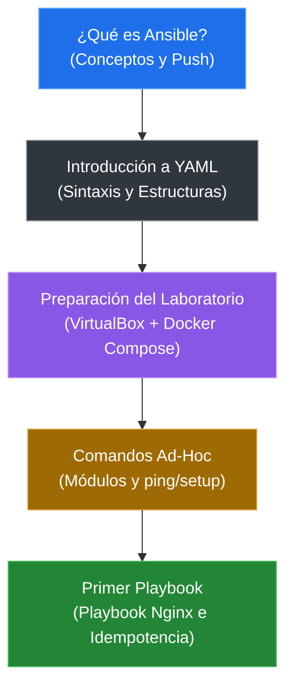

# Ansible desde Cero: Automatiza Linux y Servidores

Aprende Ansible desde sus fundamentos teóricos, pasando por el lenguaje YAML y los comandos ad-hoc, hasta desplegar tu primer playbook automatizado e idempotente sobre un laboratorio multi-servidor en Docker.

## Ruta De Aprendizaje

| Bloque | Tema | Ir |
|---|---|---|
| 01 | ¿Qué es Ansible? Conceptos y Arquitectura | [Abrir](./clases/01-introduccion-ansible.md) |
| 02 | Introducción al Lenguaje YAML | [Abrir](./clases/02-introduccion-yaml.md) |
| 03 | Preparación del Entorno y Laboratorio | [Abrir](./clases/03-preparacion-laboratorio.md) |
| 04 | Primeros Pasos con Comandos Ad-Hoc | [Abrir](./clases/04-comandos-ad-hoc.md) |
| 05 | Desarrollo de tu Primer Playbook | [Abrir](./clases/05-primer-playbook.md) |

> El índice sigue rigurosamente el contenido y la estructura de los slides oficiales del curso.

### Mapa Rápido del Curso

## Laboratorios

| Laboratorio | Descripción | Ir |
|---|---|---|
| 01. Autobiografía YAML | Práctica guiada de estructuración, mapas, listas y formato en YAML. | [Abrir](./laboratorios/01-autobiografia-yaml.md) |
| 02. Comandos Ad-Hoc | Pruebas de conectividad y gestión remota rápida de servidores. | [Abrir](./laboratorios/02-comandos-ad-hoc.md) |
| 03. Despliegue de Nginx | Creación, ejecución y verificación de un playbook automatizado e idempotente. | [Abrir](./laboratorios/03-primer-playbook-nginx.md) |

## Material de Apoyo

| Material | Descripción |
|---|---|
| [Slides completos](./material/Sesion01.pdf) | Slides Completo del curso |
