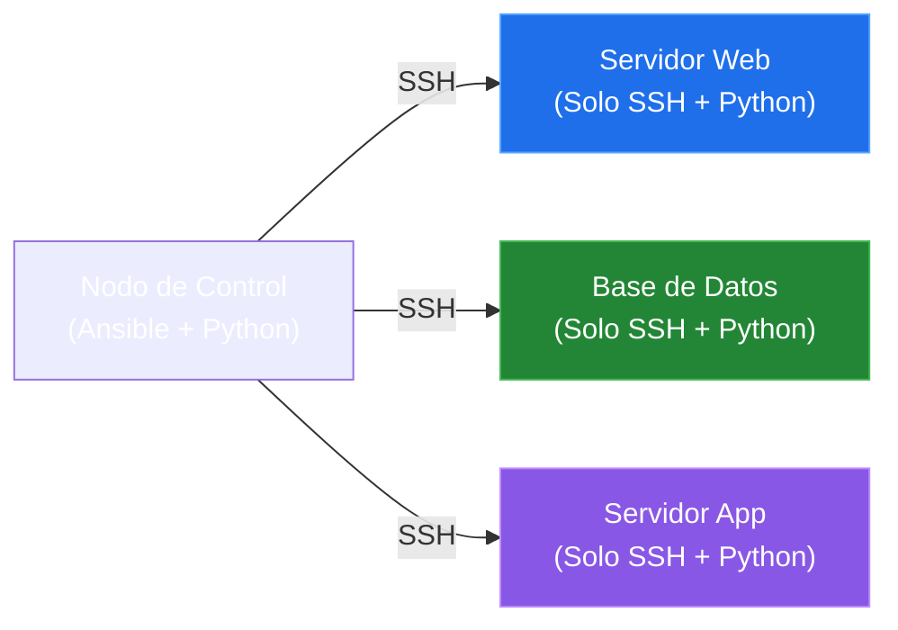

# Clase 01: ¿Qué es Ansible y por qué automatizar?

En esta clase sentamos las bases del curso. Descubrirás el problema de la administración manual de servidores, la solución que ofrece Ansible, su filosofía, diferencias frente a los scripts tradicionales y su arquitectura sin agentes (*agentless*).

---

## 1. El Problema: Administración Manual de Servidores

Cuando administramos uno o dos servidores, ingresar por SSH y ejecutar comandos de forma manual es viable. Sin embargo, a medida que la infraestructura crece a 10, 50 o 100 máquinas, este enfoque se vuelve insostenible:

* **Inconsistencia:** Es fácil cometer errores tipográficos, olvidar un paso en una máquina o instalar una versión de paquete ligeramente distinta.
* **Lentitud:** Configurar servidores uno por uno consume mucho tiempo y desvía al equipo de tareas de mayor valor.
* **Falta de Auditoría:** No hay un registro claro ni versionable de qué se instaló, quién lo hizo o bajo qué parámetros.
* **Error Humano:** Un simple error en una línea de comandos puede traducirse en horas de caída de servicio y depuración.

> [!ALERT]
> **Resultado:** Procesos lentos, inconsistentes y altamente propensos a fallos.

---

## 2. La Solución: Ansible

**Ansible** es un motor de automatización de TI de código abierto, creado originalmente por Michael DeHaan en 2012 y adquirido por **Red Hat** en 2015. 

Su propósito central es servir como **"documentación ejecutable"**: el mismo archivo de configuración que describe el estado de tu servidor sirve para aplicarlo de forma automatizada.

### ¿Para qué sirve?
1. **Gestión de Configuración:** Definir paquetes, archivos y usuarios en múltiples servidores de manera estandarizada.
2. **Despliegue de Aplicaciones:** Publicar aplicaciones de forma repetible en entornos de desarrollo, pruebas y producción.
3. **Orquestación:** Coordinar tareas secuenciales o complejas que involucren a diferentes máquinas (ej. apagar servidor A, actualizar B, reiniciar A).
4. **Aprovisionamiento:** Integrarse con nubes públicas o hipervisores para crear máquinas y prepararlas desde cero.

---

## 3. Scripts Tradicionales vs Ansible

Es común preguntarse por qué no seguir utilizando scripts en Bash o Python. La siguiente tabla compara ambos enfoques:

| Característica | Scripts Tradicionales (Bash, Python) | Ansible (Automatización Declarativa) |
|---|---|---|
| **Enfoque** | **Imperativo:** Ejecutan pasos de forma estrictamente secuencial ("cómo hacerlo"). | **Declarativo:** Declaran el estado deseado en el que debe quedar el sistema ("qué hacer"). |
| **Control de Errores** | Requieren lógica manual compleja para controlar excepciones y fallos en cada paso. | Cuenta con gestión de errores nativa y reporta el estado detallado de cada tarea. |
| **Reutilización** | Difíciles de mantener y adaptar a medida que cambian los entornos y equipos. | Playbooks altamente legibles, modulares y fáciles de versionar con Git. |
| **Idempotencia** | Repetir el script puede romper configuraciones o duplicar líneas si no se programa con extremo cuidado. | **Idempotencia nativa:** Ejecutar la misma tarea múltiples veces solo aplica cambios si es estrictamente necesario. |

---

## 4. ¿Por qué elegir Ansible?

Ansible se ha convertido en el estándar de la industria gracias a cuatro pilares fundamentales:

1. **Agentless (Sin Agentes):** No requiere instalar software, demonios ni agentes adicionales en los servidores remotos. 
2. **YAML Legible:** Las instrucciones se escriben en YAML, un lenguaje de marcado limpio que se lee casi como inglés plano.
3. **Solo necesita SSH:** Utiliza la conexión segura estándar ya disponible de forma nativa en cualquier servidor Linux.
4. **Idempotencia:** Si el servidor ya está en el estado deseado, Ansible no realiza ningún cambio, garantizando estabilidad.

---

## 5. Arquitectura Agentless (Modelo Push)

A diferencia de otras herramientas que requieren que los servidores remotos pregunten periódicamente a un servidor central (modelo *Pull*), Ansible funciona bajo el **Modelo Push**: el nodo de control empuja activamente las configuraciones a las máquinas administradas.

> [!NOTE]
> Al no requerir agentes en las máquinas gestionadas, se reduce significativamente la superficie de ataque y el uso de recursos en los servidores remotos.

---

[Anterior: Índice del Curso](../README.md) | [Siguiente: Clase 02 - Introducción a YAML](./02-introduccion-yaml.md)
