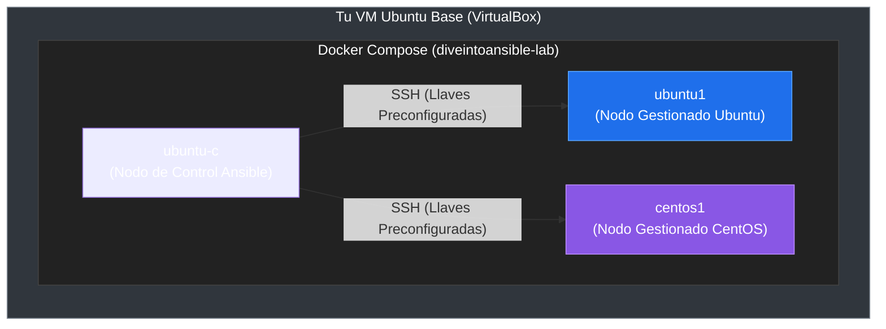

# Clase 03: Preparación del Entorno y Laboratorio

Para aprender Ansible de forma práctica y segura sin riesgo de afectar servidores de producción, levantaremos un laboratorio multi-servidor dentro de una máquina virtual (VM) utilizando Docker. En esta clase, cubriremos las herramientas necesarias, la arquitectura de red del lab y los pasos detallados de configuración.

---

## 1. Herramientas del Laboratorio

1. **VirtualBox + VM Ubuntu:** Crearemos una máquina virtual con Ubuntu Server 22.04 LTS en nuestra computadora física (anfitrión). Esta VM actuará como nuestro hipervisor/host principal del laboratorio.
2. **Docker y Docker Compose:** Dentro de la VM de Ubuntu, instalaremos Docker. Usaremos contenedores ligeros para simular múltiples servidores (nodos) interconectados de forma instantánea.
3. **Dive Into Ansible Lab:** Utilizaremos un entorno preconfigurado de código abierto (`spurin/diveintoansible-lab`) que define un contenedor de control con Ansible preinstalado y varios contenedores gestionados con las llaves SSH listas.

---

## 2. Instalación de Ansible (por Sistema Operativo)

Si deseas instalar Ansible directamente en tu máquina local o en un servidor dedicado, los comandos oficiales son:

### Ubuntu / Debian
```bash
sudo apt update
sudo apt install ansible -y
```

### RHEL / CentOS / Fedora
```bash
sudo dnf install ansible -y
```

### macOS (vía Homebrew)
```bash
brew install ansible
```

> [!NOTE]
> **En nuestro laboratorio:** No necesitas instalar Ansible en tu computadora física ni en la VM directamente. El contenedor de control llamado `ubuntu-c` ya viene con Ansible instalado y configurado de fábrica.

---

## 3. Arquitectura del Laboratorio

El laboratorio simula un entorno real con un nodo controlador y nodos administrados de diferentes sistemas operativos.



---

## 4. Preparación del Entorno Paso a Paso

### Paso 1: Instalar VirtualBox
Descarga e instala **VirtualBox** en tu computadora física desde el sitio web oficial.

### Paso 2: Crear la VM Ubuntu Base
1. Descarga la ISO de **Ubuntu Server 22.04** (o superior).
2. Crea una nueva máquina virtual en VirtualBox con la ISO.
3. Asigna al menos **2 GB de RAM** y **2 CPUs** virtuales.
4. **Configura la Red:** Agrega un adaptador de red en modo **Adaptador Sólo-Anfitrión** (Host-Only) o **Puente** (Bridge) para tener conectividad IP directa desde tu máquina anfitriona.
5. Completa la instalación de Ubuntu Server.

### Paso 3: Levantar el Laboratorio en la VM
Una vez dentro de la terminal de tu VM Ubuntu recién creada, ejecuta los siguientes comandos:

1. **Actualizar el sistema e instalar Docker + Git:**
   ```bash
   sudo apt update && sudo apt install docker.io docker-compose-v2 git -y
   ```
2. **Clonar el repositorio del laboratorio:**
   ```bash
   git clone https://github.com/spurin/diveintoansible-lab.git
   ```
3. **Iniciar el laboratorio en segundo plano:**
   ```bash
   cd diveintoansible-lab && sudo docker compose up -d
   ```

---

## 5. Verificación del Entorno

El laboratorio levantará contenedores interconectados. El nodo `ubuntu-c` actuará como tu terminal de Ansible.

Para ingresar a este nodo y verificar que todo funcione correctamente, ejecuta:

1. **Entrar al contenedor de control:**
   ```bash
   sudo docker exec -it ubuntu-c bash
   ```
2. **Verificar la versión de Ansible instalada:**
   ```bash
   ansible --version
   ```
3. **Probar la conexión SSH directa a los nodos (sin contraseña):**
   ```bash
   ssh ubuntu1
   # (escribe 'exit' para volver al contenedor ubuntu-c)
   
   ssh centos1
   # (escribe 'exit' para volver al contenedor ubuntu-c)
   ```

Si los comandos responden exitosamente, ¡tu laboratorio está listo para la acción!

---

[Anterior: Clase 02 - Introducción a YAML](./02-introduccion-yaml.md) | [Siguiente: Clase 04 - Comandos Ad-Hoc](./04-comandos-ad-hoc.md)
