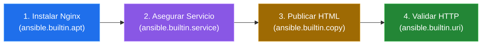

# Clase 05: Desarrollo de tu Primer Playbook

En esta clase daremos el paso definitivo en Ansible: pasaremos de ejecutar comandos ad-hoc sueltos en la terminal a consolidar nuestra infraestructura como código mediante **Playbooks**. Diseñaremos y explicaremos un playbook completo para instalar y configurar Nginx con un sitio web personalizado.

---

## 1. De Comandos Ad-Hoc a Playbooks

Los comandos ad-hoc son útiles para consultar o cambiar algo rápido, pero no son auditables ni repetibles fácilmente por otros miembros del equipo. 

Los **Playbooks** resuelven esto al agrupar la automatización en archivos de texto YAML. Esto nos permite:
* Versionar la infraestructura con Git.
* Compartir y documentar de forma clara los pasos de despliegue.
* Diseñar flujos complejos con variables, condicionales y manejadores de eventos.

---

## 2. Estructura y Partes Principales de un Playbook

Un Playbook contiene una lista de **Plays** (representados por guiones `-` al nivel principal). Cada Play asocia un conjunto de servidores con una lista ordenada de tareas.

### Playbook Mínimo
```yaml
---
- name: Verificar conexion en servidores web
  hosts: web
  become: true
  tasks:
    - name: Comprobar ping
      ansible.builtin.ping:
```

### Componentes Clave:
* **`name`:** Nombre descriptivo y legible por humanos de lo que hace el Play (o la tarea).
* **`hosts`:** Define el grupo o servidor objetivo del inventario (ej. `web`, `db`, `all`).
* **`become`:** Si se define en `true`, Ansible ejecutará las tareas con privilegios administrativos (`sudo`).
* **`tasks`:** Define el bloque que contiene la secuencia ordenada de tareas que Ansible aplicará una por una.

---

## 3. Anatomía de una Tarea

Cada elemento dentro de `tasks` es una tarea individual. Ansible las procesa de arriba hacia abajo.

```yaml
- name: Instalar Nginx
  ansible.builtin.apt:
    name: nginx
    state: present
    update_cache: true
```

* **`name`:** Describe qué hace la tarea. Se muestra en la pantalla durante la ejecución.
* **`ansible.builtin.apt`:** Llama al módulo específico. Es una buena práctica usar el nombre calificado completo (FQCN) con `ansible.builtin`.
* **`name: nginx` y `state: present`:** Son los argumentos pasados al módulo para indicarle qué paquete queremos y que debe estar instalado.

---

## 4. Despliegue Automatizado de Nginx

Nuestro objetivo es instalar Nginx, habilitar su inicio automático, publicar una página HTML personalizada y comprobar que responda.

### Flujo de Trabajo



### Código Completo del Playbook (`nginx.yml`)
Crea un archivo llamado `nginx.yml` con el siguiente contenido:

```yaml
---
- name: Desplegar Servidor Web Nginx
  hosts: web
  become: true
  tasks:
    - name: Instalar Nginx
      ansible.builtin.apt:
        name: nginx
        state: present
        update_cache: true

    - name: Asegurar que Nginx este iniciado y habilitado
      ansible.builtin.service:
        name: nginx
        state: started
        enabled: true

    - name: Publicar pagina HTML personalizada
      ansible.builtin.copy:
        dest: /var/www/html/index.html
        content: |
          <!DOCTYPE html>
          <html>
          <head>
              <title>Servidor Ansible</title>
          </head>
          <body>
              <h1>Servidor Gestionado con Ansible</h1>
              <p>Despliegue e infraestructura totalmente automatizados.</p>
          </body>
          </html>
        owner: www-data
        group: www-data
        mode: '0644'
```

---

## 5. Idempotencia y Lectura del Resultado

Una de las mayores ventajas de Ansible es su comportamiento **idempotente**: si ejecutas el playbook `nginx.yml` en una máquina limpia, aplicará los cambios (`changed`). Si lo ejecutas una segunda vez inmediatamente después, no modificará nada (`ok`), ya que detectará que el sistema ya está en el estado deseado.

### Estados de Respuesta de Ansible

| Estado | Significado en Consola | Acción Realizada |
|---|---|---|
| **`ok`** | Color Verde | El sistema ya estaba en el estado deseado. No se hizo ningún cambio. |
| **`changed`** | Color Amarillo | Ansible modificó la configuración del sistema para llevarlo al estado deseado. |
| **`failed`** | Color Rojo | La tarea falló. La ejecución se detiene para ese host. |
| **`skipped`** | Color Celeste / Gris | La tarea no se ejecutó debido a una condición no cumplida. |
| **`unreachable`** | Color Rojo Brillante | No se pudo establecer conexión SSH con el host. |

---

## 6. Ejecución y Validación del Playbook

### Comandos de Ejecución

```bash
# 1. Simulación o Simulación de Cambios (Dry Run)
ansible-playbook -i inventory.ini nginx.yml --check

# 2. Ejecución Formal del Playbook
ansible-playbook -i inventory.ini nginx.yml

# 3. Ejecución en Modo Detallado (Verbosity) para depurar errores
ansible-playbook -i inventory.ini nginx.yml -v
```

### Comandos de Validación
Para verificar que el sitio web funciona desde el nodo de control:
```bash
# Consultar el estado de systemd de forma remota
ansible web -i inventory.ini -m command -a "systemctl status nginx"

# Hacer una petición HTTP para verificar el HTML publicado
ansible web -i inventory.ini -m uri -a "url=http://localhost"
```

---

## 7. Errores Comunes y Soluciones

* **`UNREACHABLE`:** Comprueba las llaves SSH, que el host esté encendido y que el usuario definido en `inventory.ini` sea correcto.
* **Error de Sintaxis YAML:** Revisa que no hayas usado tabulaciones (`TAB`), que los dos puntos tengan espacio (`clave: valor`) y que la indentación esté perfectamente alineada.
* **Permiso Denegado (Failed to change ownership):** Asegúrate de incluir `become: true` a nivel de Play o tarea para que Ansible pueda escribir como `root`.
* **Paquete no encontrado (Unable to locate package):** Agrega `update_cache: true` en la tarea de `apt` para actualizar los repositorios locales antes de buscar el paquete.

---

[Anterior: Clase 04 - Comandos Ad-Hoc](./04-comandos-ad-hoc.md) | [Siguiente: Laboratorio 01 - Autobiografía YAML](../laboratorios/01-autobiografia-yaml.md)
